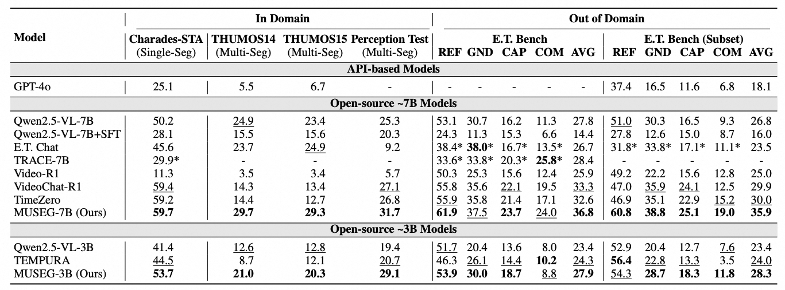

# MUSEG: Reinforcing Video Temporal Understanding via Timestamp-Aware Multi-Segment Grounding

[[📖 Paper](https://arxiv.org/abs/2505.20715)] [[🤗 MUSEG-7B](https://huggingface.co/Darwin-Project/MUSEG-7B)] [[🤗 MUSEG-3B](https://huggingface.co/Darwin-Project/MUSEG-3B)]
[[🤖 MUSEG-7B](https://www.modelscope.cn/models/Darwin_Project/MUSEG-7B)] [[🤖 MUSEG-3B](https://www.modelscope.cn/models/Darwin_Project/MUSEG-3B)]

## Introduction

We propose MUSEG 🌟, a novel RL-based method that enhances temporal understanding by introducing timestamp-aware multi-segment grounding. MUSEG enables MLLMs to align queries with multiple relevant video segments, promoting more comprehensive temporal reasoning ⏳. To facilitate effective learning, we design a customized RL training recipe with phased rewards that progressively guides the model toward temporally grounded reasoning. Extensive experiments on temporal grounding and time-sensitive video QA tasks demonstrate that MUSEG significantly outperforms existing methods and generalizes well across diverse temporal understanding scenarios 🚀.

## Performance



## Environment Setup

```bash
conda create -n museg python=3.11
conda activate museg
pip install -r requirements.txt
pip install flash_attn==2.7.4.post1
apt update
apt install openjdk-11-jdk
```

## Training

### Data Preparation

- Download videos of [Charades](https://prior.allenai.org/projects/charades) (480p version), and [E.T. Instruct 164k](https://huggingface.co/datasets/PolyU-ChenLab/ET-Instruct-164K) (only videos of activitynet, didemo, hacs and tacos are needed). You may also download the videos directly with the following commands.

```bash
wget https://ai2-public-datasets.s3-us-west-2.amazonaws.com/charades/Charades_v1_480.zip
wget https://huggingface.co/datasets/PolyU-ChenLab/ET-Instruct-164K/resolve/main/videos/activitynet.tar.gz
wget https://huggingface.co/datasets/PolyU-ChenLab/ET-Instruct-164K/resolve/main/videos/didemo.tar.gz
wget https://huggingface.co/datasets/PolyU-ChenLab/ET-Instruct-164K/resolve/main/videos/hacs.tar.gz
wget https://huggingface.co/datasets/PolyU-ChenLab/ET-Instruct-164K/resolve/main/videos/tacos.tar.gz
```

- Unzip and organize videos as follows.

```plain
MUSEG
 ├─ scripts
 ├─ src
 ├─ data
 └─ videos
     ├─ charades
     └─ et_instruct_164k
         ├─ activitynet
         ├─ didemo
         ├─ hacs
         └─ tacos
```

### Model Preparation

We use [Qwen2.5-VL-7B-Instruct](https://huggingface.co/Qwen/Qwen2.5-VL-7B-Instruct) and [Qwen2.5-VL-3B-Instruct](https://huggingface.co/Qwen/Qwen2.5-VL-3B-Instruct) as our base models.

### Start Training

```bash
./scripts/train_stage_1.sh
./scripts/train_stage_2.sh
```

Remember to set path of checkpoints before training. It takes about 22 hours for MUSEG-7B stage 1 training and 27 hours for MUSEG-7B stage 2 training with 8 × A100(80G) GPUs.

## Evaluation

### Data Preparation

- Download videos of [Charades](https://prior.allenai.org/projects/charades) (480p version), [Perception Test](https://github.com/google-deepmind/perception_test) (validation set), [THUMOS14](https://www.crcv.ucf.edu/THUMOS14/home.html) (validation set), [THUMOS15](http://www.thumos.info/home.html) (validation set), and [E.T. Bench](https://huggingface.co/datasets/PolyU-ChenLab/ETBench). You may also download the videos directly with the following commands.

```bash
wget https://ai2-public-datasets.s3-us-west-2.amazonaws.com/charades/Charades_v1_480.zip
wget https://storage.googleapis.com/dm-perception-test/zip_data/valid_videos.zip
wget https://storage.googleapis.com/thumos14_files/TH14_validation_set_mp4.zip
wget http://storage.googleapis.com/www.thumos.info/thumos15_zips/thumos15_validation_complete.zip
files=(
    "charades_sta" "cross_task" "ego4d_nlq" "hirest" "ht_step" "perception_test" "qa_ego4d"
    "qvhighlights" "star" "summe" "thumos14" "thumos15" "tvsum" "youcook2" "youtube_highlights"
)
for file in "${files[@]}"; do
    wget https://huggingface.co/datasets/PolyU-ChenLab/ETBench/resolve/main/videos/${file}.tar.gz
done
```

- Unzip and organize videos as follows.

```plain
MUSEG
 ├─ scripts
 ├─ src
 ├─ data
 └─ videos
     ├─ charades
     ├─ perception_test
     ├─ thumos14
     ├─ thumos15
     └─ et_bench
         ├─ charades_sta
         ├─ cross_task
         ├─ ego4d_nlq
         ├─ hirest
         └─ ...
```

- (Optional) Some of videos in E.T. Bench may not be loaded correctly by our evaluation script. You may run the following script to fix this.

```bash
python data/eval/et_bench/process_videos.py
```

### Model Preparation

Download MUSEG-7B [here](https://huggingface.co/Darwin-Project/MUSEG-7B) and MUSEG-3B [here](https://huggingface.co/Darwin-Project/MUSEG-3B).

### Start Evaluation

```bash
# Charades-STA
./scripts/eval_grounding_charades_sta.sh
# Perception Test
./scripts/eval_grounding_perception_test.sh
# THUMOS14
./scripts/eval_grounding_thumos14.sh
# THUMOS15
./scripts/eval_grounding_thumos15.sh
# E.T. Bench
./scripts/eval_et_bench.sh
# E.T. Bench (Subset)
./scripts/eval_et_bench_subset.sh
```

## Acknowledgements

We sincerely appreciate the contributions of the open-source community. We thank the following projects:

[Open-R1-Video](https://github.com/Wang-Xiaodong1899/Open-R1-Video), [Video-R1](https://github.com/tulerfeng/Video-R1), [R1-V](https://github.com/Deep-Agent/R1-V), [E.T. Bench](https://github.com/PolyU-ChenLab/ETBench).

## Citation

If you find our work helpful for your research, please consider citing our work.

```plain
@article{luo2025museg,
    title={MUSEG: Reinforcing Video Temporal Understanding via Timestamp-Aware Multi-Segment Grounding}, 
    author={Fuwen Luo and Shengfeng Lou and Chi Chen and Ziyue Wang and Chenliang Li and Weizhou Shen and Jiyue Guo and Peng Li and Ming Yan and Ji Zhang and Fei Huang and Yang Liu},
    journal={arXiv preprint arXiv:2505.20715},
    year={2025}
}
```
